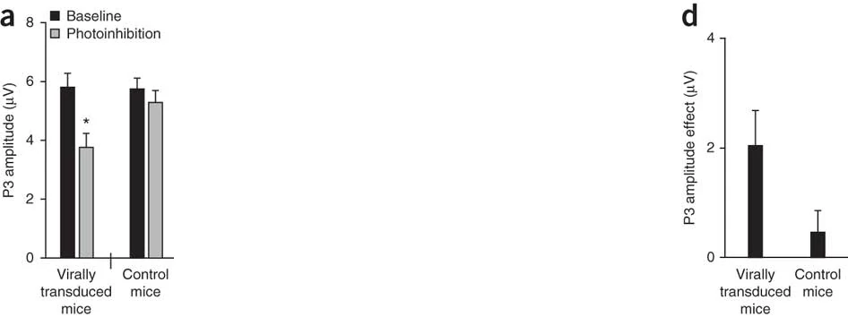

```{r,echo=FALSE}
## Set default options for the knitr RMD processing
knitr::opts_chunk$set(echo=FALSE,warning=FALSE,message=FALSE,fig.width=5,fig.height=5,cache=FALSE,autodep=TRUE, results="hide")
library(pander)
library(knitr)
library(kableExtra)
library(tidyverse)
library(tmod)
library(tidyverse)
library(limma)
library(GEOquery)
library(DESeq2)
## install bioshmods from github.com/bihealth/bioshmods
library(bioshmods)
library(tmod)
library(cowplot)
library(stringr)
library(ggvenn)
library(ggplot2)
library(ggpval)
library(eulerr)
library(Biobase)
library(org.Hs.eg.db)
theme_set(theme_minimal() + theme(panel.grid.major = element_blank(), panel.grid.minor = element_blank()))
source("functions.R")
```

```{r echo=FALSE,include=FALSE,eval=TRUE}
options(crayon.enabled = TRUE)
options(crayon.colors = 256)
knitr::knit_hooks$set(output = function(x, options){
  paste0(
    '<pre class="r-output"><code>',
    fansi::sgr_to_html(x = htmltools::htmlEscape(x), warn = FALSE),
    '</code></pre>'
  )
})

## this is an ugly, ugly hack, but otherwise crayon does not LISTEN TO REASON!!!
num_colors <- function(forget=TRUE) 256
library(crayon)
assignInNamespace("num_colors", num_colors, pos="package:crayon")
```

```{r,echo=FALSE}
## Set default options for the knitr RMD processing
knitr::opts_chunk$set(echo=FALSE,warning=FALSE,message=FALSE,fig.width=5,fig.height=5,cache=FALSE,autodep=TRUE, results="hide")
```

```{r libraries,cache=FALSE}
library(tidyverse)
library(limma)
library(GEOquery)
library(DESeq2)
## install bioshmods from github.com/bihealth/bioshmods
library(bioshmods)
library(tmod)
library(cowplot)
library(stringr)
library(ggvenn)
library(ggplot2)
library(ggpval)
library(eulerr)
library(Biobase)
library(pander)
library(org.Hs.eg.db)
library(pwr)
theme_set(theme_minimal() + theme(panel.grid.major = element_blank(), panel.grid.minor = element_blank()))
source("functions.R")
```

```{r setup}
padj_thr <- 0.05
lfc_thr  <- 1
n_stratum <- 10 # 2 strata (male and female) per condition 
lfc_thresholds <- c(0, 0.5, 1, 1.5, 2, 2.5, 3)
```

```{r pheno_data_download,eval=FALSE}
## this sometimes fails. The RDS of the object is provided
Sys.setenv(VROOM_CONNECTION_SIZE=8*131072)

## with getGEO, we can only get the phenoData
geo <- getGEO("GSE156063")[[1]]
saveRDS(geo, file="GSE156063.geo")
```

```{r pheno_data_cleanup}
geo <- readRDS("GSE156063.geo")
covar <- as(phenoData(geo), "data.frame")

## remove columns with only one value
boring <- map_lgl(covar, ~ length(unique(.x)) == 1)
covar <- covar[ , !boring ] 

## clean up
covar <- covar %>% 
  dplyr::rename(gender = "gender:ch1") %>%
  mutate(disease = gsub(" .*", "", .data[["disease state:ch1"]])) %>%
  mutate(label = description) %>%
  mutate(group = disease) %>%
  arrange(description) %>%
  dplyr::select(all_of(c("title", "label", "gender", "disease", "group")))
```

```{r featuredata_download}
## the counts must be downloaded from GEO separately.
if(!file.exists("GSE156063_swab_gene_counts.csv.gz")) {
  download.file("https://ftp.ncbi.nlm.nih.gov/geo/series/GSE156nnn/GSE156063/suppl/GSE156063_swab_gene_counts.csv.gz",
                "GSE156063_swab_gene_counts.csv.gz")
}

counts <- read_csv("GSE156063_swab_gene_counts.csv.gz")
.tmp <- counts[[1]]
counts <- as.matrix(counts[,-1])
rownames(counts) <- .tmp
#counts <- counts[ , covar$description ]
counts <- counts[ , covar$label ]
lcpm   <- edgeR::cpm(counts, log=TRUE)
#stopifnot(all(colnames(counts) == covar$description))
stopifnot(all(colnames(counts) == covar$label))

annot <- data.frame(ENSEMBL = rownames(counts))

.tmp <- mapIds(org.Hs.eg.db, annot$ENSEMBL, column=c("ENTREZID"), keytype="ENSEMBL")
annot$ENTREZID <- .tmp[ match(annot$ENSEMBL, names(.tmp)) ]

.tmp <- mapIds(org.Hs.eg.db, annot$ENSEMBL, column=c("SYMBOL"), keytype="ENSEMBL")
annot$SYMBOL <- .tmp[ match(annot$ENSEMBL, names(.tmp)) ]

.tmp <- mapIds(org.Hs.eg.db, annot$ENSEMBL, column=c("GENENAME"), keytype="ENSEMBL")
annot$GENENAME <- .tmp[ match(annot$ENSEMBL, names(.tmp)) ]
```


```{r Preparation_of_the_covariates,cache=FALSE}
sel <- covar$group %in% c("no", "SC2")
counts <- counts[ , sel ]
covar  <- covar[ sel, ]
covar$group <- as.character(covar$group)

set.seed(0123)

#covar$disease <- covar$group

g1 <- covar %>% mutate(n=1:n()) %>%
  group_by(gender, disease) %>% slice_sample(n=n_stratum) %>% pull(n)
g2 <- covar %>% mutate(n=1:n()) %>% filter(!n %in% g1) %>%
  group_by(gender, disease) %>% slice_sample(n=n_stratum) %>% pull(n)

covar$group <- NA
covar$group[g1] <- "G1"
covar$group[g2] <- "G2"

covar$group.disease <- paste0(covar$group, '_', covar$disease)

```

```{r DESeq2,cache=TRUE}
## DESeq2 calculations
## manual cache, since the operation takes a long time
sel <- !is.na(covar$group)

ds2 <- DESeqDataSetFromMatrix(counts[,sel], colData=covar[sel, ], design=~ 0 + group.disease )

ds2_file <- "ds2_cached.rds"
if(TRUE || !file.exists(ds2_file)) {
  message("Running DESeq2")
  ds2 <- DESeq(ds2)
  saveRDS(ds2, file=ds2_file)
} else {
  message("Reading ds2 from manual cache")
  ds2 <- readRDS(ds2_file)
}
```

```{r DE_analysis}
library(tidyverse)
library(tmod)
res <- list()
res$g1 <- results(ds2, contrast=c(-1, 1, 0, 0))
res$g2 <- results(ds2, contrast=c(0, 0, -1, 1))

res <- map(res, ~ .x %>% as.data.frame() %>%
  rownames_to_column("ENSEMBL") %>% 
  left_join(annot, by="ENSEMBL") %>%
  mutate(DEG=!is.na(padj) & abs(log2FoldChange) > lfc_thr & padj < padj_thr)) 

res.merged <- merge(res$g1, res$g2, by=c("ENSEMBL", "SYMBOL", "ENTREZID", "GENENAME"), suffixes=c(".g1", ".g2"))
```


```{r GO_db_prepare,cache=TRUE}
library(msigdbr)
min_mod_size <- 10
max_mod_size <- 50
msig_go_bp <- msigdbr(subcategory="GO:BP")
mset <- makeTmodFromDataFrame(msig_go_bp, 
                              feature_col="human_gene_symbol", 
                              module_col="gs_exact_source", 
                              title_col="gs_name")
mset$MODULES$N <- map_int(mset$MODULES$ID, ~ length(mset$MODULES2GENES[[.x]]))
mset <- mset[ mset$MODULES$N <= max_mod_size & 
              mset$MODULES$N >= min_mod_size ]
```


```{r GSEA,cache=TRUE}
common <- res.merged %>% filter(DEG.g1 & DEG.g2) %>% pull(SYMBOL)
gsea_res <- map(res, ~ {
  fg <- .x %>% filter(padj < padj_thr & abs(log2FoldChange) > lfc_thr)
  fg <- setdiff(fg$SYMBOL, common) # only "specific" genes
  tmodHGtest(fg=fg, bg=.x$SYMBOL, mset=mset)
})
gsea_res_full <- map(res, ~ {
  fg <- .x %>% filter(padj < padj_thr & abs(log2FoldChange) > lfc_thr)
  fg <- setdiff(fg$SYMBOL, common) # only "specific" genes
  tmodHGtest(fg=fg, bg=.x$SYMBOL, mset=mset, qval = Inf)
})
message("G1 ", nrow(gsea_res$g1), " G2 ", nrow(gsea_res$g2))
gsea_res.merged <- merge(gsea_res$g1, gsea_res$g2, by=c("ID", "Title"), suffixes=c(".g1", ".g2"), all=T)
saveRDS(gsea_res.merged, file="gsea_res_merged.rds")
```

```{r interaction}
res$int <- results(ds2, contrast=c(-1, 1, 1, -1)) %>%
  as.data.frame() %>%
  rownames_to_column("ENSEMBL") %>% 
  left_join(annot, by="ENSEMBL") %>%
  mutate(DEG=!is.na(padj) & abs(log2FoldChange) > lfc_thr & padj < 0.05)

fg <- res$int %>% filter(padj < padj_thr & abs(log2FoldChange) > lfc_thr)
if(nrow(fg) > 0) {
  gsea_res$int <-  tmodHGtest(fg=fg$SYMBOL, bg=res$int$SYMBOL, mset=mset)
}

tmod_res <- list()
tmod_res$int <- tmodCERNOtest(res$int %>% arrange(pvalue) %>% pull(SYMBOL),
                              mset=mset)
```

```{r correlation_coefs}
## calculate correlation coefficients for various groups of genes
## all correlations are significant

cors <- list()
cors$all <- with(res.merged, 
                cor(log2FoldChange.g1, log2FoldChange.g2))
cors$sign <- with(res.merged %>% filter(DEG.g1 | DEG.g2), 
                cor(log2FoldChange.g1, log2FoldChange.g2))
cors$g1 <- with(res.merged %>% filter(DEG.g1 & !DEG.g2), 
                cor(log2FoldChange.g1, log2FoldChange.g2))
cors$g2 <- with(res.merged %>% filter(!DEG.g1 & DEG.g2), 
                cor(log2FoldChange.g1, log2FoldChange.g2))

```


```{r full_dataset,cache=TRUE}
ds2_full <- DESeqDataSetFromMatrix(counts, colData=covar, design=~ disease )
ds2_full<- DESeq(ds2_full)
res$full <- results(ds2_full, name="disease_SC2_vs_no") %>% as.data.frame() %>%
  rownames_to_column("ENSEMBL") %>% 
  left_join(annot, by="ENSEMBL") %>%
  mutate(DEG=!is.na(padj) & abs(log2FoldChange) > lfc_thr & padj < padj_thr)
```

```{r g_specific}
g1_spec <- res.merged %>% filter(DEG.g1 & !DEG.g2) %>% pull(ENSEMBL)
g2_spec <- res.merged %>% filter(!DEG.g1 & DEG.g2) %>% pull(ENSEMBL)
```


## Absence of evidence is not evidence of absence



.myfootnote[
*Nieuwenhuis, Sander, Birte U. Forstmann, and Eric-Jan Wagenmakers.
"Erroneous analyses of interactions in neuroscience: a problem of
significance." Nature neuroscience 14.9 (2011): 1105-1107."*
]

---

## Half of the researchers get it wrong

```{r results="markdown"}
foo <- read.table(text="Nature\tScience\tNature Neuroscience\tNeuron\tJournal of Neuroscience\tSummed
Total reviewed\t34\t45\t117\t106\t211\t513
Correct count\t3\t9\t17\t13\t36\t78
Error count\t7\t11\t16\t15\t30\t79", sep="\t")
colnames(foo) <- gsub("\\.", " ", colnames(foo))
kable(foo)
```

.myfootnote[
*Nieuwenhuis, Sander, Birte U. Forstmann, and Eric-Jan Wagenmakers.
"Erroneous analyses of interactions in neuroscience: a problem of
significance." Nature neuroscience 14.9 (2011): 1105-1107."*
]

---


.pull-left[

Consider two group of patients, G1 and G2. Each group contains 
`r n_stratum * 4`
individuals. 

In each group, there is an equal number of healthy
individuals (labeled "Ctrl")
or patients infected with Sars-Cov-2 (labeled "SC2"). Our aim is to understand
the differences between G1 and G2 in the response to infection. 

]

.myfootnote[
Weiner, Obermayer & Beule, "Erroneous use of Venn diagrams leads to
artifacts in transcriptomic analyses", submitted.
]

---

**Table 1** Overall design in the case study: transcriptomic changes due to
Sars-Cov-2 infection. The table shows number of patients in each
combination of study group / disease status.


```{r results="markdown"}
tab <- as.data.frame(matrix(2 * n_stratum, ncol=2, nrow=2))
tab <- data.frame(c("", "Disease status", ""), c("", "Sars-Cov-2 infection", "Another infection"), 
  c("Group 1 (G1)", tab[[1]]), c("Group 2 (G2)", tab[[2]]))

colnames(tab) <- c("", "", "Study group", "")
kable(tab)
```

---

## "Specific" ("unique", "characteristic" genes)

.pull-left[

```{r fig1_1, fig.width=5,fig.height=5,dpi=300,dev="png"}
p1 <- ggvenn(list(G1=res$g1 %>% filter(DEG) %>% pull(ENSEMBL),
                         G2=res$g2 %>% filter(DEG) %>% pull(ENSEMBL)),
             show_percentage=FALSE) +
      ggtitle("Differentially expressed genes")
p1

```

]

.pull-right[

  Venn diagrams illustrate a procedure to select genes which are thought to
  be specific or characteristic for a given comparison.

  **Genes which are significant in one condition, but not the other, are
  considered "specific".**

  This is incorrect: difference between significant and non-significant is
  not significant!

]

---

## The groups G1 and G2 do not differ

We have sampled 80 samples from a larger data set and randomly assigned
them to two group, G1 and G2

---

## The reality

.pull-left[

```{r fig2, fig.width=5, fig.height=5, dpi=300,dev="png"}
#id    <- gsub(" ", "_", toupper("response to interferon beta"))
#gstitle    <- "GOBP_TOLL_LIKE_RECEPTOR_4_SIGNALING_PATHWAY"
gstitle    <- "GOBP_INTERLEUKIN_7_MEDIATED_SIGNALING_PATHWAY"
gsid  <- gsea_res$g2 %>% filter(grepl(gstitle, Title)) %>% pull(ID)
gsgenes <- mset$MODULES2GENES[[gsid]]
sel   <- res.merged %>% filter(SYMBOL %in% gsgenes) %>% arrange(pvalue.g2) %>% 
  filter(DEG.g2 & !DEG.g1) %>%
  dplyr::slice(1:4) %>% pull(ENSEMBL)

sample_sel <- c(g1, g2)

group_lab <- gsub("_no", "/Ctrl", gsub("_SC2", "/SC2", covar$group.disease))

pees <- map(sel, ~ {
  s1 <- res$g1 %>% dplyr::slice(match(.x, ENSEMBL)) %>% pull(padj)
  s2 <- res$g2 %>% dplyr::slice(match(.x, ENSEMBL)) %>% pull(padj)
  id <- res$g1 %>% dplyr::slice(match(.x, ENSEMBL)) %>% pull(SYMBOL)

  ggplot_gene(lcpm[.x, sample_sel ], 
              group_lab[ sample_sel ],
              annotation=format.pval(c(s1, s2), digits=2), textsize=8,
              pval_text_adj=.5) +
            ggtitle(id)
})

part1 <- plot_grid(plotlist=pees, labels="AUTO", ncol=2)

tmp <- res.merged %>% mutate(specific= 
                             ifelse(DEG.g1 & !DEG.g2,
                                    "G1", 
                                    ifelse(!DEG.g1 & DEG.g2, "G2", "NS"))) %>%
                      mutate(tlr4=SYMBOL %in% gsgenes)

part2 <- ggplot(tmp, aes(x=log2FoldChange.g1, 
                                y=log2FoldChange.g2, 
                                color=specific)) + 
         scale_color_manual(values=c(G1="red", G2="blue", NS="#666666")) +
         geom_point(alpha=.5) + xlab("G1") + ylab("G2") +
         geom_hline(yintercept=0, color="grey") +
         geom_vline(xintercept=0, color="grey") +
         geom_abline(slope=1, intercept=0, color="grey") +
         guides(color=FALSE)

part1
```

]

.pull-right[

Genes significant in one, but not the other comparison behave very
similarly

]

---

## The reality

.pull-left[

```{r}
part2
```

] 

.pull-right[

Genes significant in one, but not the other comparison behave very
similarly


]

---


```{r lit_surveys}
get_keywords <- function(file, pattern="^([a-zA-Z]+): *(.*)") {
  ll <- readLines(file)
  ll <- ll[ grepl(pattern, ll) & !grepl("^https://", ll) ]

  ret <- gsub(pattern, "\\2", ll)
  names(ret) <- gsub(pattern, "\\1", ll)
  ret <- as.list(ret)
  ret$file <- file
  ret$incorrect_count <- get_incorrect_counts(file)
  ret$incorrect_count_vdonly <- get_incorrect_counts(file, vdonly=TRUE)
  ret
}

get_incorrect_counts <- function(file, vdonly=FALSE) {

  ll <- readLines(file)

  pat <- "^https://"
  if(vdonly) {
    sum(grepl(pat, ll) & grepl("vd only", ll))
  } else {
    sum(grepl(pat, ll))
  }

}

files <- list.files(pattern="literature_survey.*.md")

finfo <- map(files, get_keywords) 
names(finfo) <- map_chr(finfo, ~ .x[["journal"]])
```

**Tab. 2** Results of the informal literature survey. 

.pull-left[
We searched for papers using Google Scholar and the keywords "venn diagram"
and "differential expression".
]

.pull-right[

```{r results="markdown"}
tab <- map_dfr(finfo, ~ 
               data.frame(Journal=.x$journal,
                          Years=.x$years,
                          Total=.x$total,
                          Analysed=.x$analysed,
                          Incorrect=.x$incorrect_count,
                          Enrichment=.x$incorrect_count - .x$incorrect_count_vdonly))  %>%
  mutate(Analysed=as.numeric(Analysed)) %>%
  mutate(Total=as.numeric(Total))


tab <- rbind(tab, 
             data.frame(Journal="**Total:**", Years="", Total=sum(tab$Total),
                        Analysed=sum(tab$Analysed),
                        Incorrect=sum(tab$Incorrect),
                        Enrichment=sum(tab$Enrichment)))
tab2 <- tab %>%
  mutate(Incorrect=sprintf("%d (%.0f%%)", Incorrect, 100 * Incorrect / Analysed)) %>%
  mutate(Enrichment=sprintf("%d (%.0f%%)", Enrichment, 100 * Enrichment / Analysed))


kable(tab2)
```

]

---

## It gets weirder

Often, researchers ask the question: what are these "specific" genes?


.pull-left[

```{r fig1_1b, fig.width=5,fig.height=5,dpi=300,dev="png"}
p1 <- ggvenn(list(G1=res$g1 %>% filter(DEG) %>% pull(ENSEMBL),
                         G2=res$g2 %>% filter(DEG) %>% pull(ENSEMBL)),
             show_percentage=FALSE)
p1

```

]

--

.pull-right[

Classical approach involves testing for gene set enrichment for the group
of "specific" genes.

]


---

## Here are the results.

```{r fig1, fig.width=15,fig.height=6.5,dpi=300,dev="png"}
p1 <- ggvenn(list(G1=res$g1 %>% filter(DEG) %>% pull(ENSEMBL),
                         G2=res$g2 %>% filter(DEG) %>% pull(ENSEMBL)),
             show_percentage=FALSE) +
      ggtitle("Differentially expressed genes")
p2 <- ggvenn(list(G1=gsea_res$g1 %>% pull(ID),
                         G2=gsea_res$g2 %>% pull(ID)),
              show_percentage=FALSE) +
      ggtitle("Enriched GO terms")

col1 <- plot_grid(p1, p2, labels="AUTO", nrow=2)

p3 <- plot_gsea(gsea_res$g1 %>% arrange(P.Value) %>% dplyr::slice(1:10)) + ggtitle("G1") +
  scale_x_discrete(labels=function(x) str_wrap(x, width=25))
#p3 <- plot_grid(p3, NULL, ncol=1, rel_heights=c(2, 1))
p4 <- plot_gsea(gsea_res$g2 %>% arrange(P.Value) %>% dplyr::slice(1:10)) + ggtitle("G2") +
  scale_x_discrete(labels=function(x) str_wrap(x, width=25))

plot_grid(plotlist = list(col1, p3, p4), labels=c('', 'C', 'D'), nrow=1)
```

---

## Wait, what?

.pull-left[

These enrichments don't look random!

]

.pull-right[

```{r fig1_c, fig.width=10,fig.height=5.5,dpi=300,dev="png"}
plot_grid(p3, p4, nrow=1)
```

]

---

## Here is what happens

---

## "Specific" genes are likely FNs


```{r fig3,dpi=300,dev="png"}
tmp <- merge(res.merged, res$full, by="ENSEMBL")
tmp <- tmp[ , c("DEG.g1", "DEG.g2", "DEG") ]
colnames(tmp) <- c("G1", "G2", "Full dataset")
plot(euler(tmp), quantities=list(type=c("counts", "percent")))
```

---

## Can we get rid of it in another way?

```{r montecarlo,cache=TRUE,fig.width=7.5,fig.height=6.5}
## note: given that the monte carlo simulation is quite time consuming, we
## have included the code for it in another file, `montecarlo.R`. If trying
## to replicate this manuscript, please execute that file first to generate
## the necessary replicates.

outdir <- "montecarlo"

merged_res <- readRDS(file.path(outdir, "merged_res.rds"))

lfc_thresholds <- c(0, 0.5, 1, 1.5, 2, 2.5, 3)

by_lfc_thr <- map_dfc(lfc_thresholds, ~ 
                      get_specific_num(merged_res[["10"]], lfc_thr=.x,
                                       padj_thr=padj_thr))
colnames(by_lfc_thr) <- lfc_thresholds
by_lfc_thr <- by_lfc_thr %>% pivot_longer(everything(), names_to = "lfc")

g1 <- ggplot(by_lfc_thr, aes(x=lfc, y=value)) + geom_boxplot() +
  ylab("Number of DEGs") + xlab("log2 fold change threshold")

gsea_files <- list.files(path=outdir, pattern="gsea_.*rds", full.names=TRUE)
gsea_by_lfc_thr_files <- gsea_files[ grepl("gsea_res_10", gsea_files) ]
names(gsea_by_lfc_thr_files) <- gsub("montecarlo/gsea_res_10_([0-9.]*)\\.rds", "\\1",
                                     gsea_by_lfc_thr_files)
gsea_by_lfc_thr_files <- gsea_by_lfc_thr_files[ order(as.numeric(names(gsea_by_lfc_thr_files))) ]
gsea_by_lfc_thr <- map_dfc(gsea_by_lfc_thr_files, gsea_specific_num)
gsea_by_lfc_thr <- gsea_by_lfc_thr %>% pivot_longer(everything(), names_to = "lfc")

g2 <- ggplot(gsea_by_lfc_thr, aes(x=lfc, y=value)) + geom_boxplot() +
  ylab("Number of enriched gene sets") + xlab("log2 fold change threshold")

by_ssize <- map_dfc(c("5", "10", "20"), 
                    ~ get_specific_num(merged_res[[.x]], lfc_thr=1,
                                       padj_thr=padj_thr))
colnames(by_ssize) <- c(10, 20, 40)
by_ssize <- by_ssize %>% pivot_longer(everything(), names_to = "ss")

g3 <- ggplot(by_ssize, aes(x=ss, y=value)) + geom_boxplot() +
  ylab("Number of DEGs") + xlab("Number of samples per group/treatment")

gsea_by_ss_files <- gsea_files[ grepl("gsea_res_[0-9]*_1\\.rds", gsea_files) ]
names(gsea_by_ss_files) <- gsub("montecarlo/gsea_res_([0-9]*)_.*\\.rds", "\\1",
                                     gsea_by_ss_files)
gsea_by_ss_files <- gsea_by_ss_files[ order(as.numeric(names(gsea_by_ss_files))) ]
gsea_by_ss <- imap(gsea_by_ss_files, ~ {
                     data.frame(ss=.y, value= gsea_specific_num(.x))
                                     })
gsea_by_ss <- Reduce(rbind, gsea_by_ss)
gsea_by_ss$ss <- factor(as.numeric(gsea_by_ss$ss) * 2, levels=c(10, 20, 40))

g4 <- ggplot(gsea_by_ss, aes(x=ss, y=value)) + geom_boxplot() +
  ylab("Number of enriched gene sets") + xlab("Number of samples per group/treatment")

plot_grid(g1, g2, g3, g4, labels = LETTERS[1:4])
```

---


